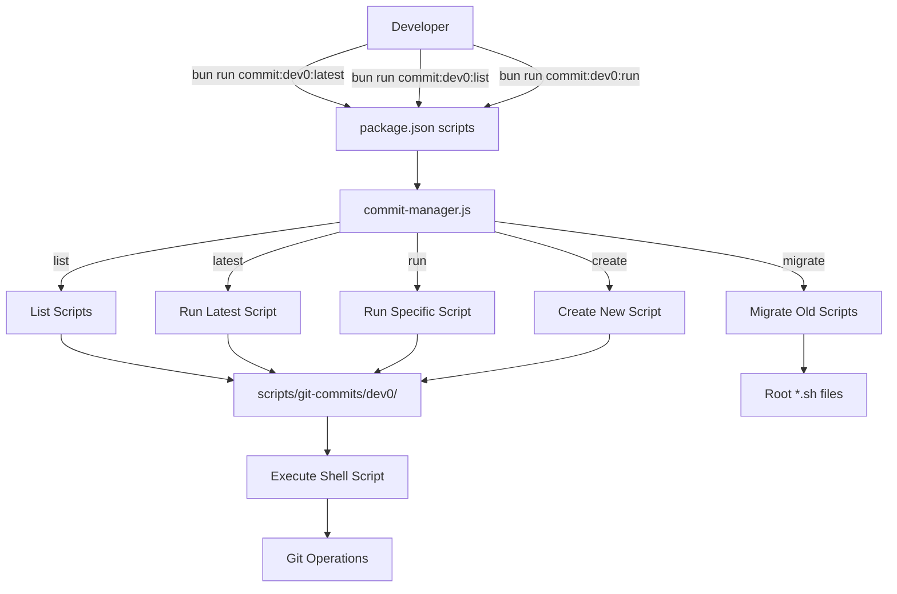

# Design Document: Git Commit Script Manager

## Overview

Git Commit Script Manager adalah sistem untuk mengorganisir dan mengelola batch git commit scripts berdasarkan mesin host developer. Sistem ini menyediakan struktur folder yang jelas, command shortcuts yang mudah digunakan, dan utilitas untuk membuat serta menjalankan script commit batch.

Sistem ini akan:
- Mengorganisir script dalam struktur folder `scripts/git-commits/{host-name}/`
- Menyediakan command shortcuts via npm/bun scripts (contoh: `bun run commit:dev0:latest`)
- Memudahkan AI assistant dalam membuat script batch baru
- Mendukung multiple host machines untuk tim development
- Migrasi script existing ke struktur baru

## Architecture

### Directory Structure

```
project-root/
├── scripts/
│   ├── git-commits/
│   │   ├── dev0/                    # Host machine: dev0
│   │   │   ├── commit-batch-20241112-143022.sh
│   │   │   ├── commit-batch-20241112-150145.sh
│   │   │   └── commit-batch-20241112-163530.sh
│   │   ├── dev1/                    # Host machine: dev1
│   │   │   └── commit-batch-20241112-120000.sh
│   │   └── .gitkeep
│   └── utils/
│       ├── commit-manager.js        # Main utility script
│       └── script-template.sh       # Template for new scripts
├── package.json                     # Updated with new scripts
└── .gitignore                       # Updated to exclude temp files
```

### System Components



## Components and Interfaces

### 1. Commit Manager Utility (`scripts/utils/commit-manager.js`)

Main utility script yang menangani semua operasi manajemen script.

**Interface:**
```javascript
// Command line interface
node scripts/utils/commit-manager.js <command> <host> [options]

// Commands:
// - list <host>              : List all scripts for host
// - latest <host>            : Run latest script for host
// - run <host> <script-name> : Run specific script
// - create <host> <content>  : Create new script
// - migrate <host>           : Migrate old scripts to new structure
```

**Functions:**
```javascript
class CommitManager {
  constructor(host) {
    this.host = host;
    this.scriptsDir = `scripts/git-commits/${host}`;
  }

  // List all scripts for the host
  async listScripts() {
    // Returns array of script info: { name, path, created, size }
  }

  // Get the latest script based on timestamp
  async getLatestScript() {
    // Returns path to latest script or null
  }

  // Execute a specific script
  async executeScript(scriptPath) {
    // Validates and executes the script
    // Returns execution result
  }

  // Create new script from template
  async createScript(commitData) {
    // Generates filename with timestamp
    // Creates script from template
    // Sets executable permissions
    // Returns script path
  }

  // Migrate old scripts
  async migrateScripts(pattern = 'git-commit-*.sh') {
    // Finds matching scripts in root
    // Moves to host directory
    // Creates backup
    // Returns migration report
  }

  // Validate script syntax
  async validateScript(scriptPath) {
    // Basic shell syntax validation
    // Returns validation result
  }
}
```

### 2. Script Template (`scripts/utils/script-template.sh`)

Template untuk membuat script commit batch baru.

```bash
#!/bin/bash
# Git Commit Batch Script
# Host: {{HOST}}
# Created: {{TIMESTAMP}}
# Description: {{DESCRIPTION}}

set -e  # Exit on error

echo "━━━━━━━━━━━━━━━━━━━━━━━━━━━━━━━━━━━━━━━━"
echo "🚀 Git Commit Batch: {{DESCRIPTION}}"
echo "━━━━━━━━━━━━━━━━━━━━━━━━━━━━━━━━━━━━━━━━"
echo ""

# Commit counter
COMMIT_COUNT=0

# Function to make commit
commit() {
  local message="$1"
  local files="$2"
  
  echo "📝 Commit $((++COMMIT_COUNT)): $message"
  git add $files
  git commit -m "$message"
  echo "✅ Done"
  echo ""
}

# {{COMMITS_PLACEHOLDER}}
# Example:
# commit "feat: add user authentication" "apps/web/src/auth/*"
# commit "docs: update README" "README.md"

echo "━━━━━━━━━━━━━━━━━━━━━━━━━━━━━━━━━━━━━━━━"
echo "🎉 Batch completed! ($COMMIT_COUNT commits)"
echo "━━━━━━━━━━━━━━━━━━━━━━━━━━━━━━━━━━━━━━━━"
```

### 3. Package.json Scripts

Updated scripts section untuk command shortcuts.

```json
{
  "scripts": {
    // Existing scripts...
    
    // Git commit management - dev0
    "commit:dev0:latest": "node scripts/utils/commit-manager.js latest dev0",
    "commit:dev0:list": "node scripts/utils/commit-manager.js list dev0",
    "commit:dev0:run": "node scripts/utils/commit-manager.js run dev0",
    
    // Git commit management - dev1
    "commit:dev1:latest": "node scripts/utils/commit-manager.js latest dev1",
    "commit:dev1:list": "node scripts/utils/commit-manager.js list dev1",
    "commit:dev1:run": "node scripts/utils/commit-manager.js run dev1",
    
    // Utility commands
    "commit:migrate": "node scripts/utils/commit-manager.js migrate",
    "commit:create": "node scripts/utils/commit-manager.js create"
  }
}
```

## Data Models

### Script Metadata

```typescript
interface ScriptInfo {
  name: string;           // Filename (e.g., "commit-batch-20241112-143022.sh")
  path: string;           // Full path to script
  host: string;           // Host machine identifier (e.g., "dev0")
  created: Date;          // Creation timestamp
  modified: Date;         // Last modification timestamp
  size: number;           // File size in bytes
  commitCount?: number;   // Number of commits in script (parsed from content)
  description?: string;   // Script description (parsed from header)
}
```

### Commit Data (for script creation)

```typescript
interface CommitData {
  host: string;           // Target host machine
  description: string;    // Batch description
  commits: Array<{
    message: string;      // Commit message
    files: string;        // Files to commit (glob pattern)
  }>;
}
```

### Migration Report

```typescript
interface MigrationReport {
  success: boolean;
  scriptsFound: number;
  scriptsMigrated: number;
  backupPath: string;
  errors: Array<{
    file: string;
    error: string;
  }>;
}
```

## Error Handling

### Error Types

1. **Script Not Found Error**
   - Thrown when specified script doesn't exist
   - Provides list of available scripts
   - Exit code: 1

2. **Execution Error**
   - Thrown when script execution fails
   - Captures stderr output
   - Exit code: 2

3. **Validation Error**
   - Thrown when script has syntax errors
   - Provides validation details
   - Exit code: 3

4. **Permission Error**
   - Thrown when script is not executable
   - Attempts to fix permissions automatically
   - Exit code: 4

5. **Migration Error**
   - Thrown when migration fails
   - Provides partial migration report
   - Exit code: 5

### Error Handling Strategy

```javascript
class CommitManagerError extends Error {
  constructor(message, code, details = {}) {
    super(message);
    this.code = code;
    this.details = details;
  }
}

// Usage example
try {
  await manager.executeScript(scriptPath);
} catch (error) {
  if (error instanceof CommitManagerError) {
    console.error(`❌ Error (${error.code}): ${error.message}`);
    if (error.details.suggestions) {
      console.log('\n💡 Suggestions:');
      error.details.suggestions.forEach(s => console.log(`  - ${s}`));
    }
    process.exit(error.code);
  }
  throw error;
}
```

## Testing Strategy

### Unit Tests

Test individual functions in `commit-manager.js`:

1. **Script Listing Tests**
   - Test empty directory
   - Test with multiple scripts
   - Test sorting by timestamp
   - Test filtering by host

2. **Script Execution Tests**
   - Test successful execution
   - Test execution with errors
   - Test permission handling
   - Test output capture

3. **Script Creation Tests**
   - Test template rendering
   - Test filename generation
   - Test permission setting
   - Test validation

4. **Migration Tests**
   - Test finding old scripts
   - Test moving scripts
   - Test backup creation
   - Test error handling

### Integration Tests

Test end-to-end workflows:

1. **Create and Execute Workflow**
   - Create new script via manager
   - List scripts to verify creation
   - Execute the created script
   - Verify git commits were made

2. **Migration Workflow**
   - Setup test environment with old scripts
   - Run migration
   - Verify scripts moved correctly
   - Verify backup created
   - Test executing migrated scripts

3. **Multi-Host Workflow**
   - Create scripts for multiple hosts
   - Verify isolation between hosts
   - Test switching between hosts
   - Verify correct script execution per host

### Manual Testing Checklist

- [ ] Run `bun run commit:dev0:list` on empty directory
- [ ] Create a test script manually and verify it appears in list
- [ ] Run `bun run commit:dev0:latest` and verify execution
- [ ] Run `bun run commit:dev0:run <script-name>` with specific script
- [ ] Test migration with existing git-commit-*.sh files
- [ ] Verify error messages are helpful and actionable
- [ ] Test with multiple host machines (dev0, dev1)
- [ ] Verify script permissions are set correctly
- [ ] Test script creation via AI assistant workflow

## Implementation Notes

### Naming Convention

Scripts menggunakan timestamp-based naming untuk memastikan urutan yang jelas:
- Format: `commit-batch-YYYYMMDD-HHMMSS.sh`
- Example: `commit-batch-20241112-143022.sh`
- Sorting: Alphabetical sorting = chronological sorting

### Permission Management

- Semua script harus executable (`chmod +x`)
- Manager akan otomatis set permissions saat create
- Manager akan check dan fix permissions sebelum execute

### Backward Compatibility

- Script lama di root tetap bisa dijalankan manual
- Migration adalah optional, tidak breaking
- Old scripts akan di-backup sebelum migration

### AI Assistant Integration

AI assistant dapat membuat script baru dengan:
1. Menerima instruksi dari developer
2. Generate commit list berdasarkan instruksi
3. Call commit-manager untuk create script
4. Return script path ke developer

Example workflow:
```
Developer: "Buatkan script commit untuk fitur authentication"
AI: [Analyzes changes, generates commit list]
AI: [Calls: node scripts/utils/commit-manager.js create dev0 <data>]
AI: "Script created: scripts/git-commits/dev0/commit-batch-20241112-143022.sh"
AI: "Run with: bun run commit:dev0:latest"
```

### Performance Considerations

- Script listing: O(n) where n = number of scripts
- Latest script: O(n) with early exit optimization
- Execution: Depends on git operations in script
- Migration: O(m) where m = number of old scripts

### Security Considerations

1. **Script Validation**
   - Basic syntax check before execution
   - No arbitrary code execution from user input
   - Scripts must be in designated directory

2. **Path Traversal Prevention**
   - Validate host names (alphanumeric only)
   - Validate script names (no path separators)
   - Use path.join() for safe path construction

3. **Permission Control**
   - Scripts only executable by owner
   - No world-writable permissions
   - Backup directory with restricted access

## Future Enhancements

1. **Interactive Mode**
   - Select script from list interactively
   - Preview script before execution
   - Edit script before running

2. **Script History**
   - Track execution history
   - Show last run timestamp
   - Success/failure statistics

3. **Script Tagging**
   - Add tags to scripts (feature, bugfix, etc.)
   - Filter by tags
   - Search by description

4. **Dry Run Mode**
   - Preview commits without executing
   - Validate all files exist
   - Check for conflicts

5. **Web UI**
   - Browser-based script manager
   - Visual script editor
   - Execution logs viewer
