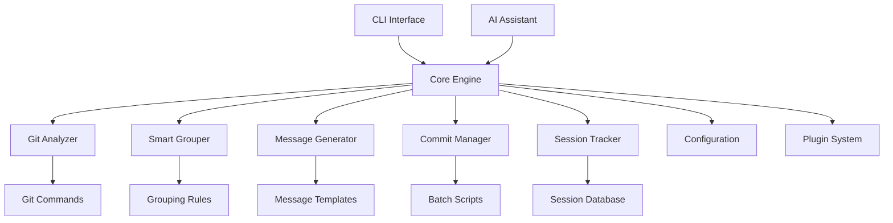
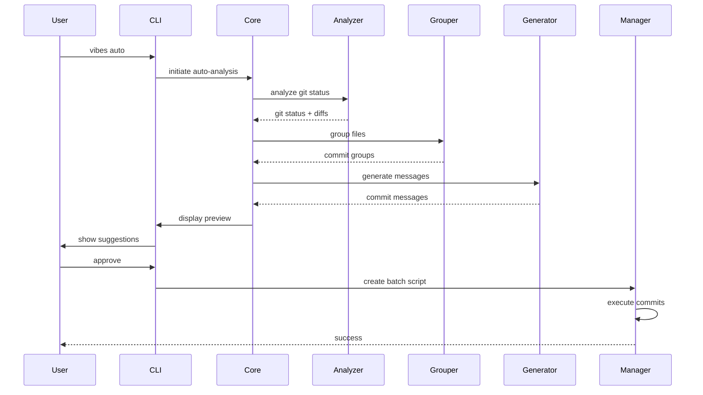
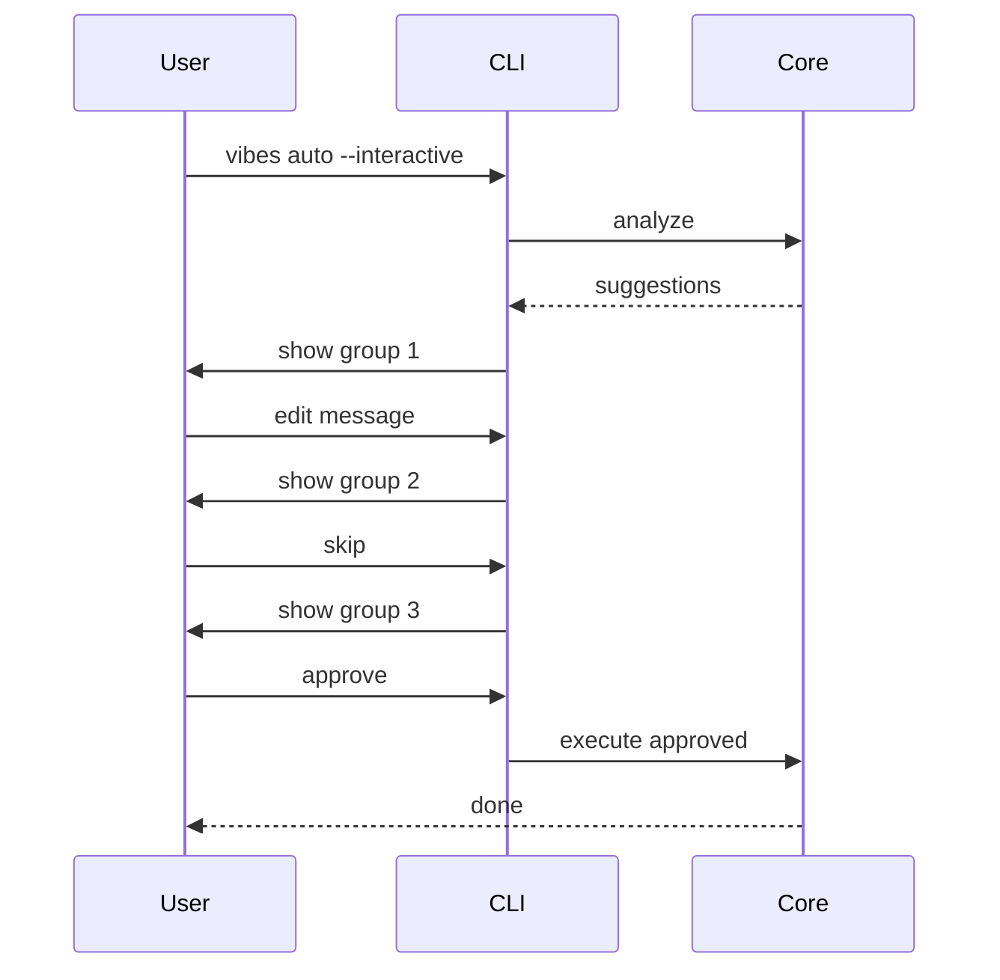

# Design Document: Vibes Commit - AI-Powered Git Commit Manager

## Overview

Vibes Commit adalah tool yang mengotomatisasi proses git commit dengan AI-powered analysis. Tool ini menganalisis perubahan code, mengelompokkan secara logical, dan generate commit messages yang meaningful, sehingga developer bisa fokus pada coding tanpa khawatir tentang commit hygiene.

**Core Philosophy:**
- **Zero Friction**: Minimal input dari user, maksimal automation
- **Intelligent**: Smart analysis dan grouping
- **Flexible**: Works for solo developers dan teams
- **Extensible**: Plugin system untuk customization

## Architecture

### High-Level Architecture



### Component Architecture

```
vibes-commit/
├── CLI Layer
│   ├── Command Parser
│   ├── Interactive Mode
│   └── Output Formatter
│
├── Core Engine
│   ├── Orchestrator
│   ├── State Manager
│   └── Error Handler
│
├── Analysis Layer
│   ├── Git Analyzer
│   ├── File Classifier
│   ├── Change Detector
│   └── Dependency Resolver
│
├── Intelligence Layer
│   ├── Smart Grouper
│   ├── Message Generator
│   ├── Pattern Matcher
│   └── AI Integration
│
├── Execution Layer
│   ├── Commit Manager
│   ├── Script Generator
│   ├── Batch Executor
│   └── Rollback Handler
│
└── Storage Layer
    ├── Session Tracker
    ├── Config Manager
    └── Cache Manager
```

## Components and Interfaces

### 1. Git Analyzer

Menganalisis git repository dan extract information tentang changes.

**Interface:**
```javascript
class GitAnalyzer {
  /**
   * Analyze current git status
   * @returns {Promise<GitStatus>}
   */
  async analyzeStatus() {
    // Returns: { staged, unstaged, untracked, modified, deleted }
  }

  /**
   * Get detailed diff for files
   * @param {Array<string>} files
   * @returns {Promise<Array<FileDiff>>}
   */
  async getDiff(files) {
    // Returns: [{ file, additions, deletions, chunks, content }]
  }

  /**
   * Detect file type and purpose
   * @param {string} filePath
   * @returns {FileType}
   */
  detectFileType(filePath) {
    // Returns: { type, category, language, framework }
  }

  /**
   * Analyze commit history
   * @param {number} limit
   * @returns {Promise<Array<Commit>>}
   */
  async getHistory(limit = 10) {
    // Returns: [{ hash, message, author, date, files }]
  }
}
```

**Data Models:**
```typescript
interface GitStatus {
  staged: string[];
  unstaged: string[];
  untracked: string[];
  modified: string[];
  deleted: string[];
  renamed: Array<{ from: string; to: string }>;
}

interface FileDiff {
  file: string;
  status: 'added' | 'modified' | 'deleted' | 'renamed';
  additions: number;
  deletions: number;
  chunks: Array<DiffChunk>;
  content: string;
}

interface FileType {
  type: 'source' | 'test' | 'config' | 'docs' | 'asset' | 'other';
  category: string; // 'frontend', 'backend', 'database', etc.
  language: string; // 'javascript', 'typescript', 'python', etc.
  framework: string; // 'react', 'vue', 'express', etc.
}
```

### 2. Smart Grouper

Mengelompokkan file changes secara intelligent berdasarkan berbagai criteria.

**Interface:**
```javascript
class SmartGrouper {
  /**
   * Group files into logical commits
   * @param {Array<FileDiff>} files
   * @param {GroupingOptions} options
   * @returns {Promise<Array<CommitGroup>>}
   */
  async groupFiles(files, options = {}) {
    // Returns: [{ files, type, scope, reason }]
  }

  /**
   * Analyze file relationships
   * @param {Array<string>} files
   * @returns {Promise<DependencyGraph>}
   */
  async analyzeRelationships(files) {
    // Returns: graph of file dependencies
  }

  /**
   * Apply custom grouping rules
   * @param {Array<GroupingRule>} rules
   */
  addGroupingRules(rules) {
    // Add custom rules for grouping
  }
}
```

**Grouping Strategies:**
1. **By Directory**: Group files in same directory
2. **By Feature**: Group related feature files (component + test + style)
3. **By Type**: Group by change type (feat, fix, docs, etc.)
4. **By Dependency**: Group files that depend on each other
5. **By Size**: Limit files per commit
6. **Custom Rules**: User-defined grouping logic

**Data Models:**
```typescript
interface CommitGroup {
  files: string[];
  type: CommitType;
  scope: string;
  reason: string;
  priority: number;
  dependencies: string[]; // Other groups this depends on
}

interface GroupingOptions {
  maxFilesPerCommit: number;
  groupByDirectory: boolean;
  groupByFeature: boolean;
  respectDependencies: boolean;
  customRules: GroupingRule[];
}

interface GroupingRule {
  name: string;
  matcher: (file: string) => boolean;
  groupWith: string[]; // Patterns to group with
  priority: number;
}
```

### 3. Message Generator

Generate commit messages yang descriptive dan follow conventions.

**Interface:**
```javascript
class MessageGenerator {
  /**
   * Generate commit message for a group
   * @param {CommitGroup} group
   * @param {FileDiff[]} diffs
   * @returns {Promise<CommitMessage>}
   */
  async generateMessage(group, diffs) {
    // Returns: { type, scope, subject, body, footer }
  }

  /**
   * Enhance message with AI
   * @param {CommitMessage} message
   * @param {string} context
   * @returns {Promise<CommitMessage>}
   */
  async enhanceWithAI(message, context) {
    // Use AI to improve message quality
  }

  /**
   * Validate message format
   * @param {CommitMessage} message
   * @returns {ValidationResult}
   */
  validateMessage(message) {
    // Check against conventional commits rules
  }
}
```

**Message Templates:**
```javascript
const templates = {
  feat: '{scope}: add {feature}',
  fix: '{scope}: resolve {issue}',
  docs: '{scope}: update {documentation}',
  refactor: '{scope}: improve {component}',
  test: '{scope}: add tests for {feature}',
  chore: '{scope}: update {task}',
};
```

**Data Models:**
```typescript
interface CommitMessage {
  type: CommitType;
  scope: string;
  subject: string;
  body?: string;
  footer?: string;
  breaking?: boolean;
}

type CommitType = 
  | 'feat' 
  | 'fix' 
  | 'docs' 
  | 'refactor' 
  | 'test' 
  | 'chore' 
  | 'style' 
  | 'perf' 
  | 'ci' 
  | 'build';
```

### 4. Session Tracker

Track coding sessions dan maintain history.

**Interface:**
```javascript
class SessionTracker {
  /**
   * Start or resume a session
   * @param {string} name
   * @returns {Promise<Session>}
   */
  async startSession(name) {
    // Create or resume session
  }

  /**
   * End current session
   * @param {SessionSummary} summary
   * @returns {Promise<void>}
   */
  async endSession(summary) {
    // Save session data
  }

  /**
   * Get session history
   * @param {SessionQuery} query
   * @returns {Promise<Array<Session>>}
   */
  async getHistory(query = {}) {
    // Query past sessions
  }

  /**
   * Get session statistics
   * @returns {Promise<SessionStats>}
   */
  async getStats() {
    // Aggregate statistics
  }
}
```

**Data Models:**
```typescript
interface Session {
  id: string;
  name: string;
  host: string;
  startTime: Date;
  endTime?: Date;
  duration?: number;
  filesChanged: number;
  commitsCreated: number;
  linesAdded: number;
  linesDeleted: number;
  commits: CommitRecord[];
}

interface SessionStats {
  totalSessions: number;
  totalCommits: number;
  averageCommitsPerSession: number;
  mostProductiveTime: string;
  topCommitTypes: Record<CommitType, number>;
}
```

### 5. AI Integration

Interface untuk integrasi dengan AI assistants.

**Interface:**
```javascript
class AIIntegration {
  /**
   * Process natural language instruction
   * @param {string} instruction
   * @param {GitStatus} context
   * @returns {Promise<CommitPlan>}
   */
  async processInstruction(instruction, context) {
    // Parse instruction and create commit plan
  }

  /**
   * Enhance commit analysis
   * @param {Array<CommitGroup>} groups
   * @returns {Promise<Array<CommitGroup>>}
   */
  async enhanceAnalysis(groups) {
    // Use AI to improve grouping and messages
  }

  /**
   * Get commit suggestions
   * @param {GitStatus} status
   * @returns {Promise<Array<CommitSuggestion>>}
   */
  async getSuggestions(status) {
    // AI-powered commit suggestions
  }
}
```

## Data Flow

### Auto-Analysis Workflow



### Interactive Mode Workflow



## Configuration

### Configuration File Format

```javascript
// vibes.config.js
module.exports = {
  // Host machine identifier
  host: 'dev0', // auto-detected or manual
  
  // Commit message format
  commitFormat: {
    type: 'conventional', // or 'custom'
    scopes: ['frontend', 'backend', 'api', 'docs'],
    maxSubjectLength: 72,
    requireScope: true,
    requireBody: false,
  },
  
  // Grouping rules
  grouping: {
    maxFilesPerCommit: 10,
    strategy: 'smart', // 'directory', 'feature', 'type', 'smart'
    customRules: [
      {
        name: 'components',
        pattern: 'src/components/**/*',
        groupWith: ['**/*.test.js', '**/*.css'],
      },
    ],
  },
  
  // Session tracking
  session: {
    autoStart: true,
    trackTime: true,
    saveHistory: true,
  },
  
  // AI integration
  ai: {
    enabled: true,
    provider: 'kiro', // or 'openai', 'anthropic'
    enhanceMessages: true,
    suggestImprovements: true,
  },
  
  // Plugins
  plugins: [
    '@vibes-commit/plugin-jira', // JIRA integration
    '@vibes-commit/plugin-slack', // Slack notifications
  ],
};
```

## Error Handling

### Error Types

1. **Git Errors**: Repository not found, no changes, merge conflicts
2. **Analysis Errors**: Cannot parse diff, unknown file type
3. **Validation Errors**: Invalid commit message, too many files
4. **Execution Errors**: Commit failed, script error
5. **Configuration Errors**: Invalid config, missing required fields

### Error Recovery

```javascript
class ErrorHandler {
  async handleError(error, context) {
    switch (error.type) {
      case 'GitError':
        return this.recoverFromGitError(error, context);
      case 'AnalysisError':
        return this.fallbackToManual(error, context);
      case 'ValidationError':
        return this.promptUserFix(error, context);
      default:
        return this.logAndExit(error);
    }
  }
}
```

## Testing Strategy

### Unit Tests
- Git Analyzer: Mock git commands
- Smart Grouper: Test grouping algorithms
- Message Generator: Test message generation
- Session Tracker: Test data persistence

### Integration Tests
- End-to-end auto-analysis workflow
- Interactive mode workflow
- AI integration workflow
- Plugin system

### Performance Tests
- Large repositories (1000+ files)
- Complex dependency graphs
- Concurrent operations

## Security Considerations

1. **Git Credentials**: Never store or log git credentials
2. **File Content**: Sanitize file content before AI processing
3. **Configuration**: Validate all config inputs
4. **Plugins**: Sandbox plugin execution
5. **API Keys**: Secure storage for AI API keys

## Performance Optimization

1. **Caching**: Cache git analysis results
2. **Lazy Loading**: Load plugins on demand
3. **Parallel Processing**: Analyze files in parallel
4. **Incremental Analysis**: Only analyze changed files
5. **Memory Management**: Stream large diffs

## Future Enhancements

1. **Web UI**: Browser-based interface
2. **VS Code Extension**: IDE integration
3. **GitHub App**: Direct GitHub integration
4. **Team Dashboard**: Centralized team analytics
5. **ML Model**: Custom ML model for commit classification
6. **Multi-repo Support**: Manage multiple repositories
7. **Commit Templates**: Pre-defined commit templates
8. **Auto-PR**: Automatic pull request creation
