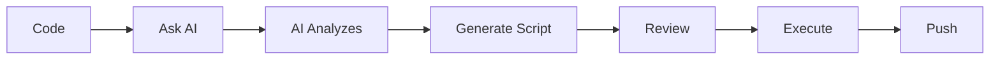
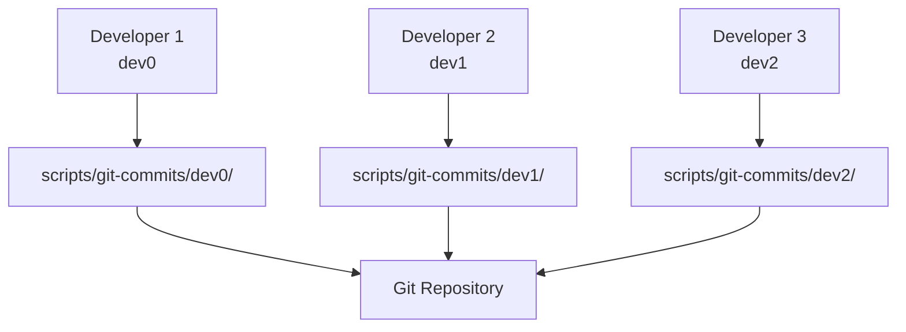

# 🎨 Git Commit Script Manager

> AI-Powered commit management system untuk developer yang produktif

## 📖 Table of Contents

- [Overview](#overview)
- [Features](#features)
- [Installation](#installation)
- [Quick Start](#quick-start)
- [Commands](#commands)
- [Workflow](#workflow)
- [Configuration](#configuration)
- [Best Practices](#best-practices)
- [Troubleshooting](#troubleshooting)
- [Advanced Usage](#advanced-usage)
- [Contributing](#contributing)

## Overview

Git Commit Script Manager adalah sistem manajemen commit yang membantu developer mengorganisir git commits dengan lebih baik. Sistem ini dirancang untuk:

- ✅ **Organize commits** - Script terorganisir per host machine
- ✅ **Batch commits** - Execute multiple commits sekaligus
- ✅ **AI-assisted** - AI assistant dapat membuat script otomatis
- ✅ **Team-friendly** - Support multiple developers
- ✅ **Clean history** - Maintain clean git history

### Why Use This?

**Problem:** Saat coding dalam "flow state", kita sering lupa commit secara teratur. Hasilnya: massive commits yang sulit di-review atau rollback.

**Solution:** Git Commit Script Manager memungkinkan Anda:
1. Code tanpa interupsi
2. Biarkan AI analyze changes
3. Generate organized commit batch
4. Review dan execute

## Features

### 🚀 Core Features

- **Auto-organize** - Script tersimpan di `scripts/git-commits/{host}/`
- **Easy commands** - Simple shortcuts via npm/bun
- **Latest script** - Otomatis jalankan script terbaru
- **Partial matching** - Tidak perlu ketik nama lengkap
- **Migration tool** - Mudah migrasi script lama
- **Multi-host** - Support multiple developer machines

### 🤖 AI Integration

- **Auto-analysis** - AI analyze git changes
- **Smart grouping** - Group related files
- **Message generation** - Generate meaningful commit messages
- **Natural language** - Instruksi dalam bahasa natural

### 👥 Team Features

- **Host-based** - Setiap developer punya namespace sendiri
- **Consistent format** - Enforce commit conventions
- **Easy sharing** - Share scripts antar team
- **History tracking** - Track siapa commit apa

## Installation

### Prerequisites

- Node.js >= 20.0.0
- Bun >= 1.0.0 (or npm/yarn)
- Git repository

### Setup

Sistem ini sudah ter-install di project kreatr.app. Untuk project baru:

```bash
# 1. Copy scripts directory
cp -r scripts/git-commits /path/to/your/project/scripts/
cp -r scripts/utils /path/to/your/project/scripts/

# 2. Copy package.json scripts
# Add these to your package.json:
{
  "scripts": {
    "commit:dev0:latest": "node scripts/utils/commit-manager.js latest dev0",
    "commit:dev0:list": "node scripts/utils/commit-manager.js list dev0",
    "commit:dev0:run": "node scripts/utils/commit-manager.js run dev0",
    "commit:migrate": "node scripts/utils/commit-manager.js migrate dev0",
    "commit:help": "node scripts/utils/commit-manager.js help"
  }
}

# 3. Initialize for your host
mkdir -p scripts/git-commits/$(hostname)
```

## Quick Start

### 1. List Available Scripts

```bash
bun run commit:dev0:list
```

Output:
```
📋 Commit Batch Scripts for dev0
━━━━━━━━━━━━━━━━━━━━━━━━━━━━━━━━━━━━━━━━━━━━━━━━━━━━━━━━━━━━━━━━━━━━━━━━━━━━━━

Name                                    Modified              Size      
────────────────────────────────────────────────────────────────────────────────
commit-batch-20251112-063700.sh         2025-11-12 06:37:00   1.9 KB     🌟

Total: 1 script(s)

💡 Run latest: bun run commit:dev0:latest
💡 Run specific: bun run commit:dev0:run <script-name>
```

### 2. Run Latest Script

```bash
bun run commit:dev0:latest
```

### 3. Run Specific Script

```bash
# Full name
bun run commit:dev0:run commit-batch-20251112-063700.sh

# Partial name (works!)
bun run commit:dev0:run 063700
```

## Commands

### List Scripts

```bash
bun run commit:dev0:list
```

Menampilkan semua script untuk host dev0 dengan:
- Nama file
- Tanggal modifikasi
- Ukuran file
- Badge 🌟 untuk script terbaru

### Run Latest

```bash
bun run commit:dev0:latest
```

Menjalankan script commit batch terbaru untuk host dev0.

### Run Specific

```bash
bun run commit:dev0:run <script-name>
```

Menjalankan script tertentu. Supports partial name matching.

### Migrate Old Scripts

```bash
bun run commit:migrate
```

Memindahkan script lama dari root project ke struktur baru.

### Help

```bash
bun run commit:help
```

Menampilkan usage information dan examples.

## Workflow

### Solo Developer Workflow



**Steps:**

1. **Code** - Focus on coding, don't worry about commits
2. **Ask AI** - "Buatkan commit batch untuk perubahan saya"
3. **AI Analyzes** - AI scan git changes dan group logically
4. **Generate Script** - AI create batch commit script
5. **Review** - Check script content
6. **Execute** - Run script to create commits
7. **Push** - Push to remote

### Team Workflow



**Benefits:**
- ✅ Setiap developer punya namespace sendiri
- ✅ Tidak ada conflict antar developer
- ✅ Easy tracking siapa commit apa
- ✅ Consistent commit format

## Configuration

### Directory Structure

```
project-root/
├── scripts/
│   ├── git-commits/
│   │   ├── dev0/                    # Host machine: dev0
│   │   │   ├── commit-batch-20251112-063700.sh
│   │   │   └── commit-batch-20251112-150000.sh
│   │   ├── dev1/                    # Host machine: dev1
│   │   │   └── git-commit-all.sh
│   │   └── README.md
│   └── utils/
│       ├── commit-manager.js        # Main utility
│       └── script-template.sh       # Template
└── package.json
```

### Naming Convention

Scripts menggunakan timestamp-based naming:

- **Format**: `commit-batch-YYYYMMDD-HHMMSS.sh`
- **Example**: `commit-batch-20251112-063700.sh`
- **Benefit**: Alphabetical = Chronological

### Script Template

Setiap script menggunakan template standar:

```bash
#!/bin/bash
# Git Commit Batch Script
# Host: dev0
# Created: 2025-11-11T23:37:00.559Z
# Description: Feature implementation

set -e  # Exit on error

# Commit counter
COMMIT_COUNT=0

# Function to make commit
commit() {
  local message="$1"
  local files="$2"
  
  echo "📝 Commit $((++COMMIT_COUNT)): $message"
  git add $files
  git commit -m "$message"
  echo "✅ Done"
  echo ""
}

# Your commits here
commit "feat: add feature" "src/feature.ts"
commit "docs: update README" "README.md"

echo "🎉 Batch completed! ($COMMIT_COUNT commits)"
```

## Best Practices

### 1. Descriptive Commit Messages

Use conventional commits format:

```bash
feat: add user authentication
fix: resolve login issue
docs: update API documentation
refactor: improve code structure
test: add unit tests
chore: update dependencies
```

### 2. Atomic Commits

Each commit should focus on one thing:

```bash
# Good ✅
commit "feat: add login form" "src/components/LoginForm.tsx"
commit "feat: add login API" "src/api/auth.ts"
commit "test: add login tests" "src/components/LoginForm.test.tsx"

# Bad ❌
commit "add login feature" "src/components/* src/api/* tests/*"
```

### 3. Logical Grouping

Group related files together:

```bash
# Component + Test + Style
commit "feat: add Button component" "src/components/Button.tsx src/components/Button.test.tsx src/components/Button.css"
```

### 4. Regular Commits

Don't wait too long before committing:

```bash
# Good ✅
- Code for 1-2 hours
- Create commit batch
- Review and execute

# Bad ❌
- Code for days
- Massive commit batch
- Hard to review
```

### 5. Review Before Execute

Always review script before executing:

```bash
# 1. List scripts
bun run commit:dev0:list

# 2. Check script content
cat scripts/git-commits/dev0/commit-batch-20251112-063700.sh

# 3. Execute if looks good
bun run commit:dev0:latest
```

## Troubleshooting

### Script Not Found

**Error:**
```
❌ Error (1): Script not found: my-script.sh
```

**Solution:**
```bash
# List available scripts
bun run commit:dev0:list

# Use correct name or partial match
bun run commit:dev0:run 20251112
```

### No Scripts Available

**Error:**
```
📭 No commit batch scripts found
```

**Solution:**
```bash
# Ask AI to create a script
"Buatkan commit batch untuk perubahan saya"

# Or create manually
# See: scripts/utils/script-template.sh
```

### Permission Denied

**Error:**
```
Permission denied: commit-batch-20251112-063700.sh
```

**Solution:**
```bash
# Fix permissions
chmod +x scripts/git-commits/dev0/*.sh

# Or let commit-manager fix it automatically
bun run commit:dev0:latest
```

### Git Not Clean

**Error:**
```
fatal: not a git repository
```

**Solution:**
```bash
# Initialize git if needed
git init

# Or run from correct directory
cd /path/to/your/project
```

## Advanced Usage

### Custom Host Names

```bash
# Use custom host identifier
node scripts/utils/commit-manager.js list my-laptop

# Add to package.json
{
  "scripts": {
    "commit:laptop:list": "node scripts/utils/commit-manager.js list my-laptop"
  }
}
```

### Direct CLI Usage

```bash
# List scripts
node scripts/utils/commit-manager.js list dev0

# Run latest
node scripts/utils/commit-manager.js latest dev0

# Run specific
node scripts/utils/commit-manager.js run dev0 <script-name>

# Migrate
node scripts/utils/commit-manager.js migrate dev0

# Help
node scripts/utils/commit-manager.js help
```

### Programmatic Usage

```javascript
const CommitManager = require('./scripts/utils/commit-manager.js');

const manager = new CommitManager('dev0');

// List scripts
const scripts = await manager.listScripts();

// Get latest
const latest = await manager.getLatestScript();

// Execute
await manager.executeScript(latest);

// Create new script
await manager.createScript({
  description: 'My feature',
  commits: [
    { message: 'feat: add feature', files: 'src/*' }
  ]
});
```

### AI Assistant Integration

**Example prompts:**

```
"Buatkan commit batch untuk Git Commit Script Manager implementation"

"Analisis perubahan saya dan buat commits yang terorganisir"

"Buat commit batch dengan 5 commits untuk fitur authentication"
```

**AI will:**
1. Analyze git changes
2. Group files logically
3. Generate commit messages
4. Create batch script
5. Save to your host directory

## Contributing

### Adding New Features

1. Create spec in `.kiro/specs/`
2. Follow requirements → design → tasks workflow
3. Implement features
4. Add tests
5. Update documentation

### Code Style

- Use JSDoc for documentation
- Follow existing patterns
- Add error handling
- Write descriptive commit messages

### Testing

```bash
# Run tests (when available)
bun test

# Test manually
bun run commit:dev0:list
bun run commit:dev0:latest
```

## Future Roadmap

See `.kiro/specs/vibes-commit-package/` for detailed plans:

- 🎯 **Auto-analysis** - AI-powered change analysis
- 🎯 **Smart grouping** - Intelligent file grouping
- 🎯 **Session tracking** - Track coding sessions
- 🎯 **Interactive mode** - Step-by-step commit approval
- 🎯 **Plugin system** - Extensible architecture
- 🎯 **Web UI** - Browser-based interface
- 🎯 **VS Code extension** - IDE integration

## License

MIT

## Support

- 📖 Documentation: `scripts/git-commits/README.md`
- 🐛 Issues: Create issue in repository
- 💬 Questions: Ask AI assistant
- 📧 Contact: Team lead

---

**Happy Committing! 🚀**
